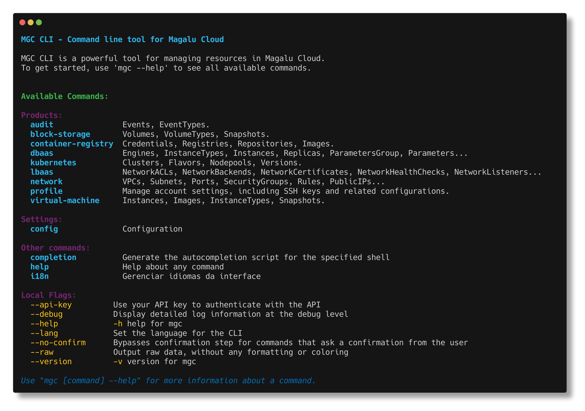

MGC CLI - Command line tool for Magalu Cloud

MGC CLI is a powerful tool for managing resources in Magalu Cloud.
To get started, use 'mgc --help' to see all available commands.

Available Commands:

Products:
  audit               todo
  blockstorage        todo
  compute             todo
  containerregistry   todo
  dbaas               todo
  kubernetes          todo
  lbaas               todo
  network             todo
  profile             todo

Settings:
  config              Configuração do CLI

Other commands:
  completion          Generate the autocompletion script for the specified shell
  help                Help about any command
  i18n                Gerenciar idiomas da interface

Local Flags:
  --api-key         Use your API key to authenticate with the API
  --debug           Display detailed log information at the debug level
  --help            -h help for mgc
  --lang            Set the language for the CLI
  --no-confirm      Bypasses confirmation step for commands that ask a confirmation from the user
  --raw             Output raw data, without any formatting or coloring
  --version         -v version for mgc

💡 Use "mgc [command] --help" for more information about a command.
