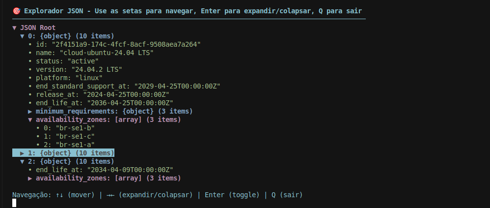
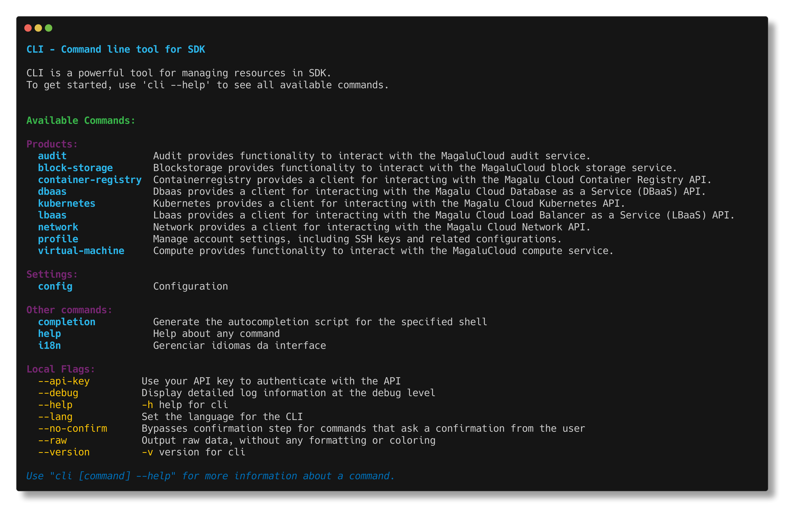

# CLI

## Disclaimer

> ⚠️ **WARNING / AVISO** ⚠️
> 
> This is NOT an official Magalu Cloud project. This is a community-driven tool that generates CLI code based on the Magalu Cloud SDK.
> 
> Este NÃO é um projeto oficial da Magalu Cloud. Esta é uma ferramenta desenvolvida pela comunidade que gera código de CLI baseado no SDK da Magalu Cloud.

> 🚫 **PRODUCTION USE WARNING / AVISO DE USO EM PRODUÇÃO** 🚫
> 
> This project is intended for development and learning purposes only. Production use is NOT recommended yet.
> 
> Este projeto é destinado apenas para fins de desenvolvimento e aprendizado. O uso em produção ainda NÃO é recomendado.

## Experimental:
`EXPLORE_JSON=1`

:brazil: 
:us:
:es:
